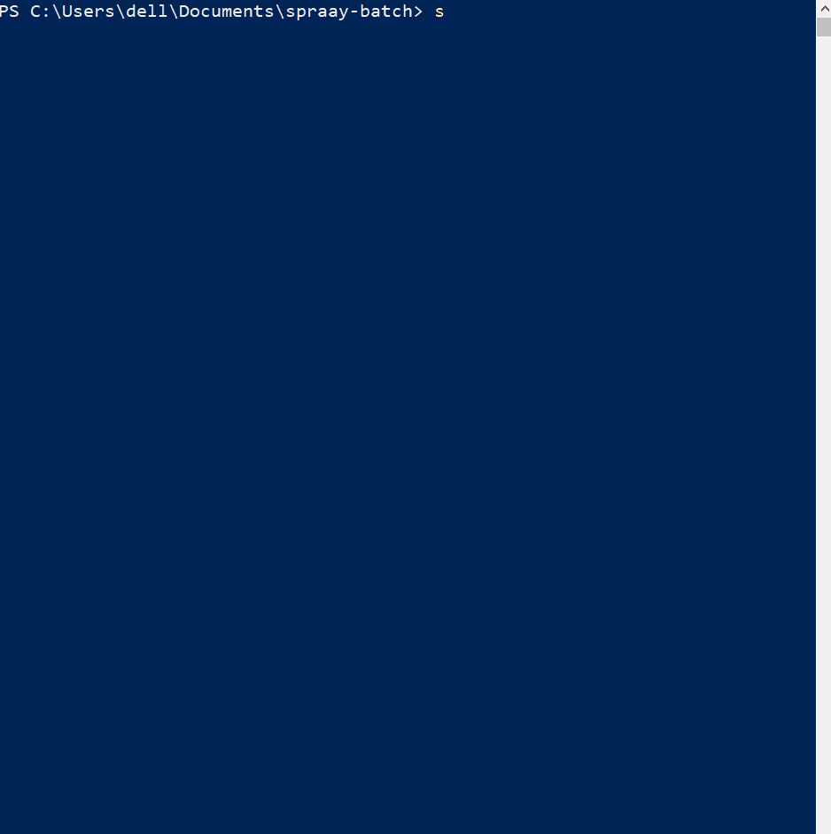

# SpraayBatch

**Agent-native, gasless USDC payments on Base — for [OpenClaw](https://github.com/BlockRunAI/ClawRouter).**
An autonomous agent gets its own non-custodial wallet and can pay one or many recipients in a
single atomic transaction — holding **only USDC, zero ETH** (gas is sponsored via the Coinbase
CDP Paymaster). Set per-agent budget caps so a parent agent can bound what each sub-agent spends.

```bash
npm install spraay-batch
```

<p align="center">
  
</p>

---

## Why SpraayBatch

|                              | **SpraayBatch** | Manual sends | Multisig (e.g. Safe) | Payroll SaaS |
| ---------------------------- | :-----------: | :----------: | :------------------: | :----------: |
| **Gasless** (zero-ETH sender) |  ✅ CDP Paymaster |      ❌       |          ❌          |  ⚠️ varies   |
| **Batch** (N recipients, 1 atomic tx) |      ✅       |   ❌ one-by-one   |      ⚠️ manual       |      ✅      |
| **Multi-token** (any ERC-20 on Base) |  ✅ address or symbol |      ✅       |          ✅          |  ⚠️ limited set |
| **Budget caps** (per agent)  |      ✅       |      ❌       |    ⚠️ policy module   |   ⚠️ seat-based |
| **Non-custodial** (key stays local) |      ✅       |      ✅       |          ✅          |  ❌ custodial |
| **Agent-native** (programmatic tools) |      ✅       |      ❌       |          ❌          |      ❌      |

## How it works

- **Non-custodial wallet.** On first run SpraayBatch creates an EVM wallet at `~/.spraay/.session`
  (or reuses one). The private key never leaves your machine and is never logged.
- **Batch payout.** "Pay N recipients" becomes a single atomic transaction via the on-chain
  Spray contract — `sprayEqual` when everyone gets the same amount (cheaper), `sprayToken` for
  per-recipient amounts. The USDC approval is sized to `payout + protocol fee`, so it can't
  revert on a short allowance.
- **Gasless (opt-in).** Point SpraayBatch at a Coinbase CDP Paymaster URL and the agent can pay
  with **zero ETH**: payouts run as sponsored ERC-4337 UserOperations from a Coinbase Smart
  Account owned by your key. When gasless is on, the address you fund with USDC is the smart
  account (shown by `spraay-batch info`).
- **Budgets.** A parent agent caps each sub-agent (`agent_id → limit`); once the cap is hit,
  that agent's payouts are blocked. Caps and spend persist locally.
- **Ledger.** Every payment is appended to `~/.spraay/ledger.jsonl` with a Basescan link;
  `spraay-batch receipts` prints recent spend.

## Quick start

```bash
npm install spraay-batch                                 # installs the OpenClaw plugin
spraay-batch info                                        # show your wallet address + network
# → fund that address with USDC on Base (Base Sepolia by default)
```

Then, from your agent, call the `spraay_batch_pay` tool — or test by hand:

```bash
spraay-batch pay 10 0xRecipientA 0xRecipientB --dry-run     # preview cost + fee, no send
spraay-batch pay 10 0xRecipientA 0xRecipientB               # pay each 10 USDC in one tx
spraay-batch pay 0.5 0xRecipientA 0xRecipientB --token WETH # or any ERC-20 (symbol or 0x address)
```

## Agent tools

Agents are the primary consumer. The plugin registers these tools (`contracts.tools`):

| Tool | What it does |
| --- | --- |
| `spraay_wallet_info` | Funding address, owner, network, gasless status, funding link |
| `spraay_balance` | Live balance of the funding address (`token` = any ERC-20; defaults to USDC) |
| `spraay_budget_set` | Set/clear a sub-agent's spend cap (USDC) |
| `spraay_budget_status` | Cap / spent / remaining for one or all agents |
| `spraay_batch_pay` | Pay N recipients in one atomic tx (`amount` = same to all, or `amounts` = per-recipient); `token` = any ERC-20 (default USDC); `dry_run`, `agent_id`, `confirm_mainnet` |
| `spraay_receipts` | Recent payments from the local ledger (optional `token` filter) |

## Slash-commands (for humans testing)

`/wallet` · `/balance [token]` · `/budget set <id> <usdc>` · `/receipts [limit] [token]` · `/pay <amountEach> <addr…> [--token addr|symbol] [--agent id] [--dry-run] [--confirm]`

## CLI

```
spraay-batch [info]                      Wallet address, network, file locations
spraay-batch balance [token]             Live token balance (defaults to USDC)
spraay-batch budget set <id> <usdc>      Set a per-agent spend cap
spraay-batch budget clear <id>           Remove a cap
spraay-batch budget status [id]          Show cap(s)
spraay-batch pay <amountEach> <addr...>  Pay each address the same amount [--token addr|symbol] [--agent id] [--dry-run] [--confirm]
spraay-batch receipts [limit] [token]    Recent payments (optional token filter)
spraay-batch export-key                  Print the private key for backup (keep it secret)
```

## Configuration

Config lives at `~/.spraay/spraay-batch.json`. Via OpenClaw plugin config or these env vars:

| Setting | Env var | Notes |
| --- | --- | --- |
| Wallet key | `EVM_PRIVATE_KEY` | Optional; auto-generated at `~/.spraay/.session` if unset |
| Network | (config `network`) | `base-sepolia` (default) or `base` |
| CDP Paymaster URL | `CDP_PAYMASTER_URL` | Enables gasless; `https://api.developer.coinbase.com/rpc/v1/base/<KEY>` |
| RPC overrides | `SPRAAY_BASE_RPC_URL`, `SPRAAY_BASE_SEPOLIA_RPC_URL` | Optional |

**Mainnet safety:** mainnet (`base`) payouts require explicit confirmation (`confirm_mainnet`
tool param / `--confirm` flag); Base Sepolia is the default.

## Pricing

- **0.30% protocol fee on mainnet batches** — e.g. a 1000 USDC batch = **3 USDC** fee. The fee is
  added on top of the payout (the sender approves/holds `payout + fee`), and every payment records
  it in the ledger. Use `dry_run` / `--dry-run` to see the exact fee before sending.
- **Testnet (Base Sepolia) is free** (0% fee) — develop and smoke-test at no cost.
- No SpraayBatch subscription or per-seat pricing: you pay only gas (or nothing, when gasless via
  the CDP Paymaster) plus the on-chain protocol fee on mainnet.

## On-chain contracts

| Network | Spray contract | USDC |
| --- | --- | --- |
| Base mainnet | `0x1646452F98E36A3c9Cfc3eDD8868221E207B5eEC` | `0x833589fCD6eDb6E08f4c7C32D4f71b54bdA02913` |
| Base Sepolia | `0xfb1B884E489B0296CefadA2d8Db7CFbD1ED62f7A` | `0x036CbD53842c5426634e7929541eC2318f3dCF7e` |

## Development

```bash
npm install
npm run typecheck    # tsc --noEmit
npm run lint         # eslint
npm test             # vitest unit tests
npm run build        # tsup -> dist/
npm run smoke        # live smoke test on Base Sepolia (needs test USDC + a little ETH)
```

Run one test file: `npx vitest run test/payout.test.ts`.
Mainnet smoke: `SMOKE_NETWORK=base SMOKE_CONFIRM=1 npm run smoke` (spends real funds).

## Security

- The private key never leaves your machine and is never logged. Back it up with
  `spraay-batch export-key`.
- Payouts are signed locally — never routed through a gateway.
- Amounts, fee, recipient count, and `paused` state are validated on-chain before signing.

## License

[MIT](LICENSE)
